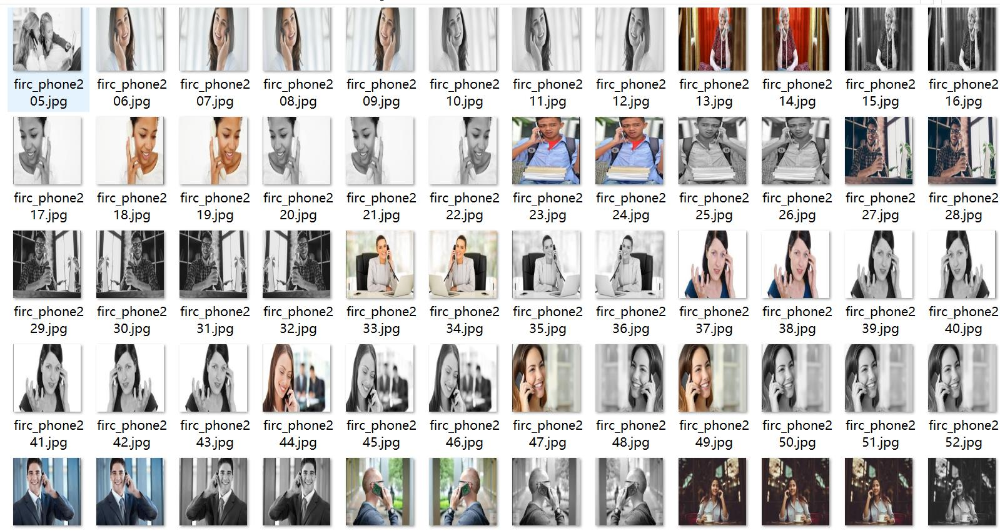
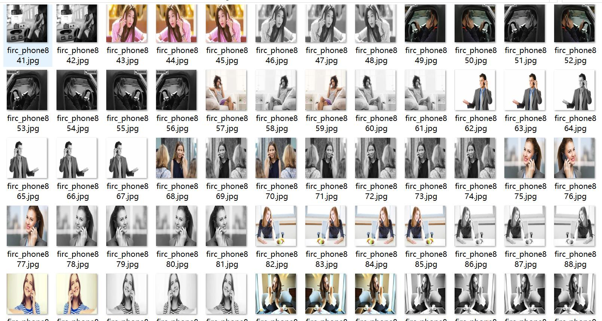
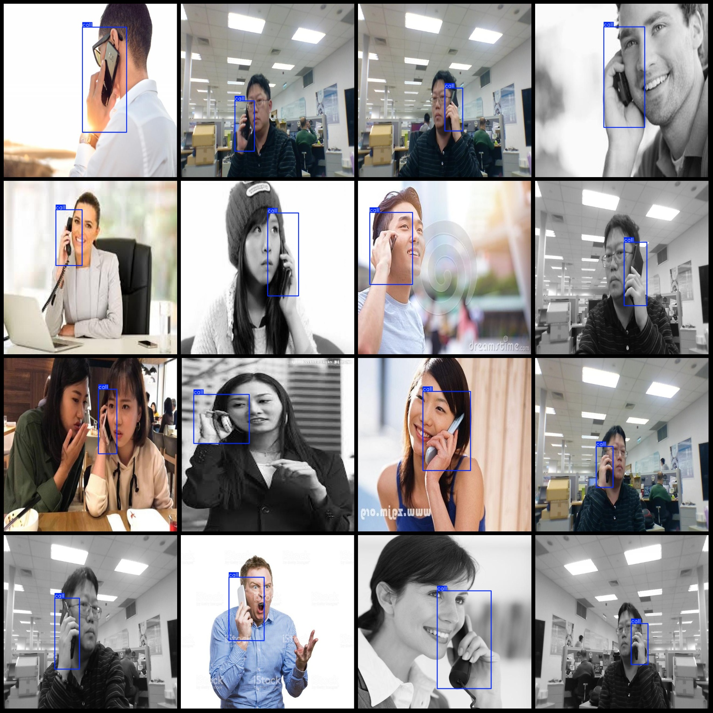
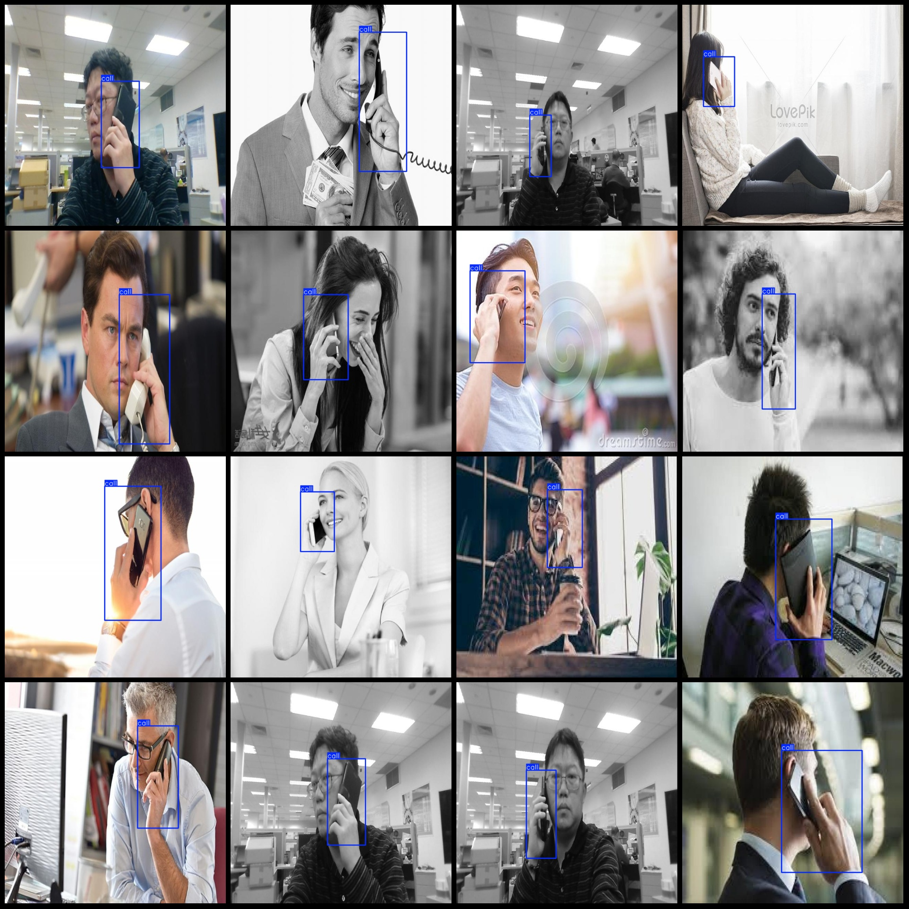

# Mobile phone calls detection dataset VOC+YOLO format, 1101 images in 1 category with enhancements

Please note that the dataset contains a large number of enhancements, and it is expected that only about 100 original images are present, with the rest being enhanced images. For specific reference, please refer to the image preview.

Dataset format: Pascal VOC format + YOLO format (excluding the split path's txt file, only containing jpg images and corresponding VOC format xml files and yolo format txt files)

number of images: 1101
annotation count: 1101
annotation count: 1101
annotationnumber of classes: 1
annotation class names:["call"]
boxes per class: 
call box count = 1130
total boxes: 1130
images per class: 
call images = 1101
image resolution: 640x640
Use annotation tool: labelImg
Annotation rules: draw a rectangle around the class.
Important notes: The dataset does not have a training/validation/test set division; you need to divide it yourself.
Special statement: This dataset does not guarantee any accuracy for the trained model or weight file.
Image preview:
## Images

Here is a pay link on Stripe ( https://buy.stripe.com/3cs8yP7sY87d0vu9AB ). Please contact me lonlonago@foxmail.com after funding $89, and I will send you a complete data files , thank you!

